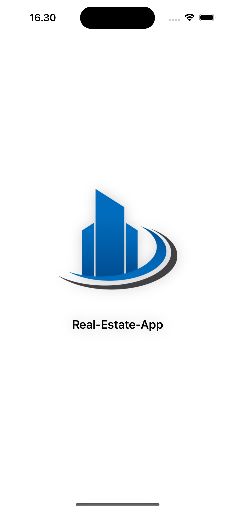
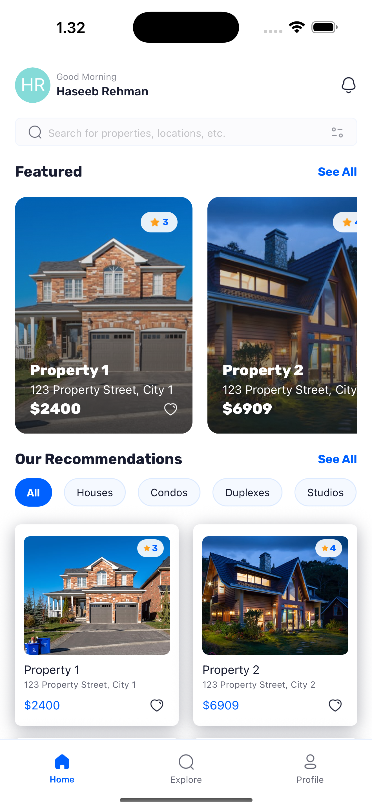
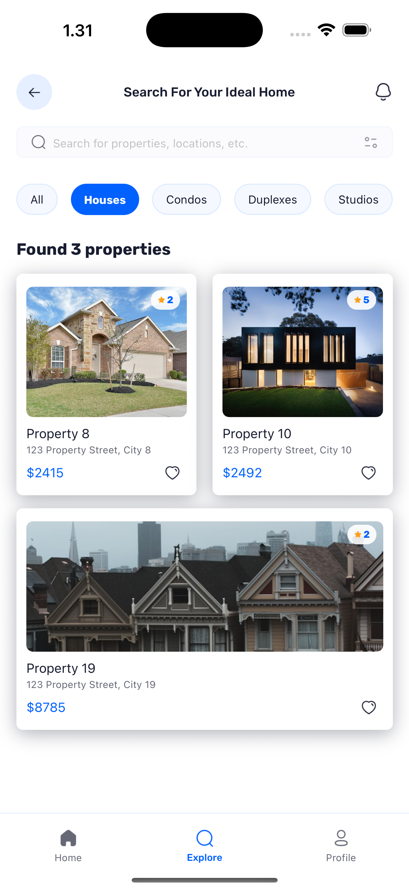
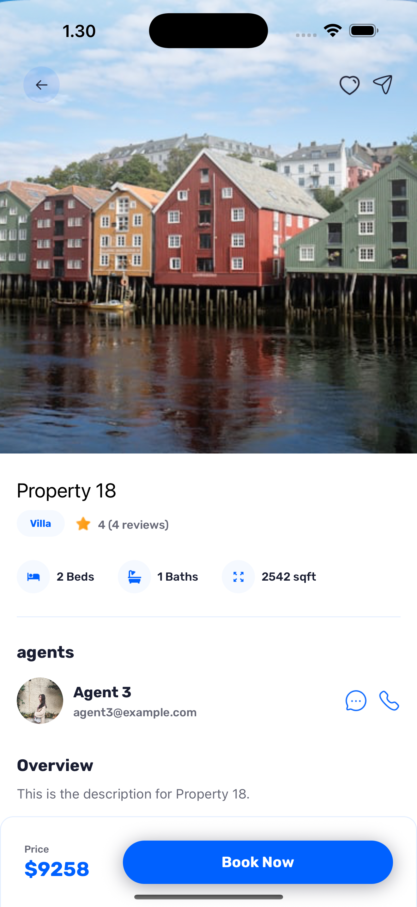

# Welcome to Real Estate app 👋

This is a hobby and learning project where I built a full-stack real estate application using React Native. The app features Google authentication, dynamic property listings, and user profiles — designed with modern tools for a seamless and scalable experience.

Built using:

- Expo SDK 52

- Appwrite (Backend as a Service)

- Tailwind CSS

- TypeScript

## Features 
- Authentication with Google: Secure and seamless user sign-ins using Google’s authentication service.
- Home Page: Displays the latest and recommended properties with powerful search and filter functionality.

- Explore Page: Allows users to browse all types of properties with a clean and intuitive interface.

- Property Details Page: Provides comprehensive information about individual properties, including images and key details.

- Profile Page: Customizable user settings and profile management

- Centralized Data Fetching: Custom-built solution inspired by TanStack’s useQuery for efficient API calls.

- and many more, including code architecture and reusability

### Credits

- This project is part of my learning towards full stack app development, and I am learning this project with JS Mastery from Youtube. 

- My goal is to practice the standard and norms of app development and I very very hopefull that after such learning projects I will be more confident and comfartable while writing and working on my own projects.

### Project Images

📸 Screenshots
<table> <tr> <td align="center"><b>Splash Screen</b> </td> <td align="center"><b>Sign-in Screen</b> </td> </tr> <tr> <td align="center"><b>Home Screen</b> </td> <td align="center"><b>Explore Screen</b> </td> </tr> <tr> <td align="center"><b>Details Screen</b> </td> <td align="center"><b>Settings Screen</b> </td> </tr> </table>

