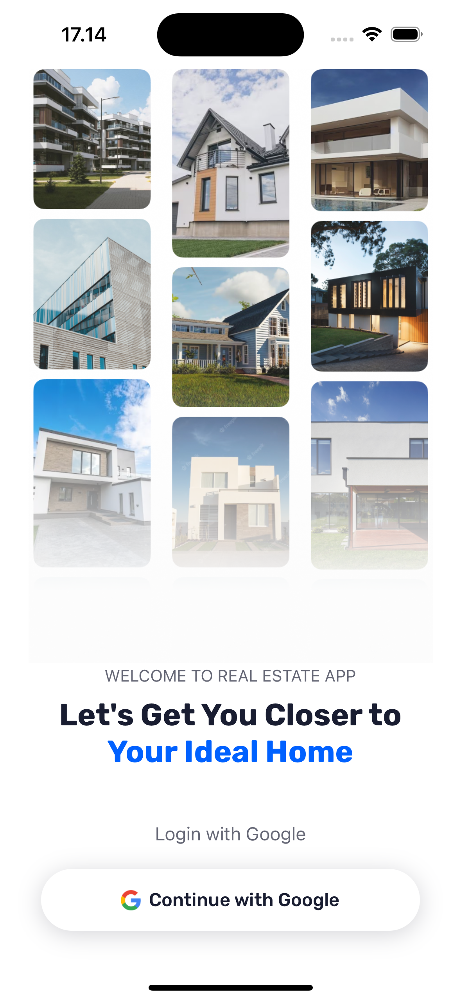
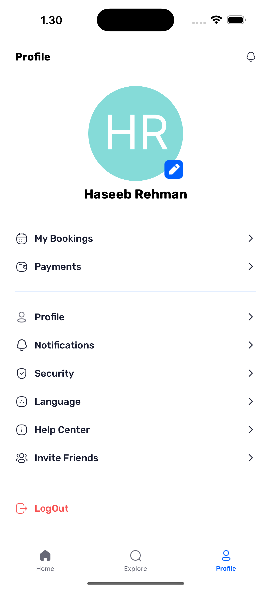

# Welcome to Real Estate app 👋

This is a Hobby and Learning Project, in which I build a full-stack Real Estate application with React Native, featuring Google authentication, dynamic property listings, and user profiles. Designed with modern tools like Expo SDK 52, Appwrite, Tailwind CSS, and TypeScript for a seamless and scalable experience.

## Features 
- Authentication with Google: Secure and seamless user sign-ins using Google’s authentication service.
- Home Page: Displays the latest and recommended properties with powerful search and filter functionality.

- Explore Page: Allows users to browse all types of properties with a clean and intuitive interface.

- Property Details Page: Provides comprehensive information about individual properties, including images and key details.

- Profile Page: Customizable user settings and profile management

- Centralized Data Fetching: Custom-built solution inspired by TanStack’s useQuery for efficient API calls.

- and many more, including code architecture and reusability

### Credits

- This project is part of my learning towards full stack app development, and I am learning this project with JS Mastery from Youtube. 

- My goal is to practice the standard and norms of app development and I very very hopefull that after such learning projects I will be more confident and comfartable while writing and working on my own projects.

### Project Images

<!--  -->
1. Splash Screen 

- 

2. Sgin-in Screen

- 

3. Home Screen

- 

4. Explore Screen

- 

5. Details Screen

- 

6. Settings Screen

- 

